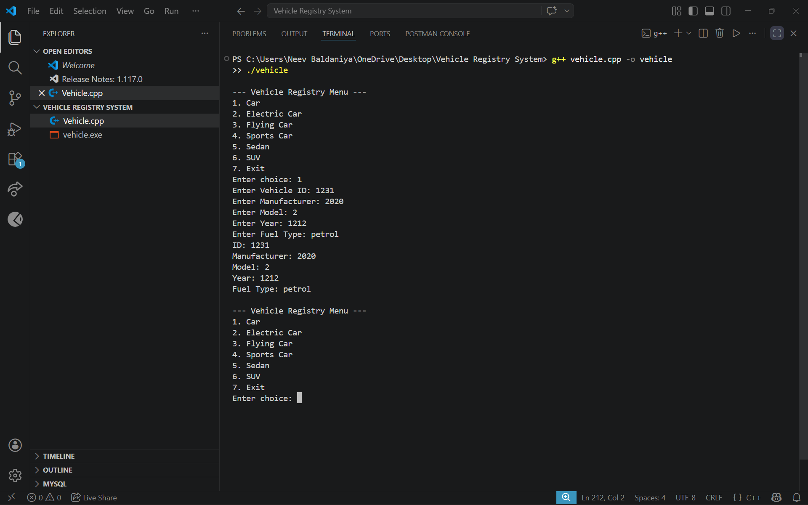

# Vehicle Registry System (C++)

## Features

* Add vehicle
* Display vehicle details
* Menu-driven program
* Uses OOP & inheritance

## How to Run

Compile:

```
g++ vehicle.cpp -o vehicle
```

Run:

```
./vehicle
```

For Windows:

```
g++ vehicle.cpp -o vehicle.exe
vehicle.exe
```

## Output



## Files

* vehicle.cpp
* output.png
* README.md
